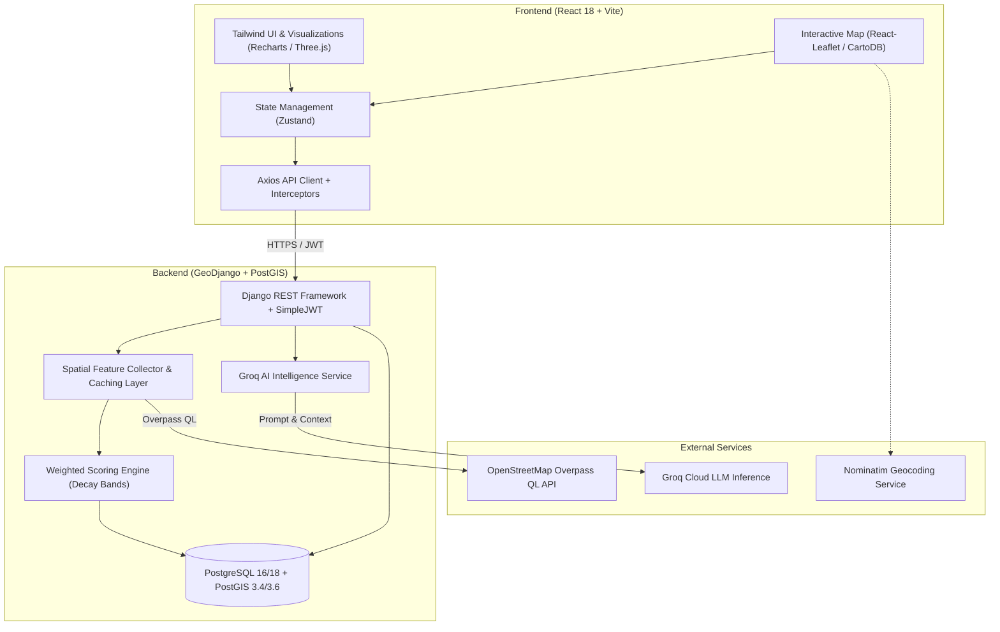

# Obrix — Intelligent Location Intelligence Platform

<div align="center">


**AI-powered geospatial analytics and multi-factor decision engine for smarter commercial site selection.**

[](https://obrix-frontend.onrender.com/)
[](https://www.djangoproject.com/)
[](https://react.dev/)
[](https://postgis.net/)
[](https://groq.com/)
[](https://vitejs.dev/)
[](https://tailwindcss.com/)
[](LICENSE)

<br />

🚀 **Live Demo:** [https://obrix-frontend.onrender.com/](https://obrix-frontend.onrender.com/)

</div>

---

## 🌐 Live Demo

The latest build of Obrix is deployed and accessible on Render:

🔗 **[https://obrix-frontend.onrender.com/](https://obrix-frontend.onrender.com/)**

---

## 📌 Overview

**Obrix** is an enterprise-grade location intelligence and site-selection analytics platform. By combining real-time **OpenStreetMap (OSM)** geospatial data, **GeoDjango / PostGIS** spatial computations, mathematical multi-factor scoring matrices, and **Groq-powered Generative AI**, Obrix empowers entrepreneurs, commercial real estate analysts, and retail chains to evaluate prospective business locations with deep data-driven confidence.

---

## ✨ Key Features

- 🗺️ **Interactive GIS Map Experience**: High-performance interactive map built on Leaflet and CartoDB Dark Matter / Positron layers with precise coordinate picking, radius rings, and Nominatim forward/reverse geocoding.
- ⚡ **Multi-Factor Scoring Engine**: Domain-tuned mathematical scoring models for diverse business categories (**Pharmacy**, **Cafe / Restaurant**, **Stationery / Bookstore**, **Grocery / Supermarket**) with distance decay bands, competition density penalties, and customizable weight configurations.
- 🤖 **Ask Obrix (AI Location Copilot)**: Groq-accelerated LLM reasoning engine providing instant spatial SWOT analysis, demographic catchment breakdown, competitive viability assessments, and conversational Q&A.
- 📊 **Executive Analytics & Visualizations**: Interactive score breakdown radars, competitor proximity maps, commercial anchor counts, and foot traffic proxies powered by Recharts and Three.js.
- 📁 **Saved Locations & Comparison**: Bookmark, categorize, and compare multiple sites side-by-side to prioritize high-potential retail locations.
- 📑 **Exportable Reports**: Generate detailed site suitability reports ready for executive stakeholder presentations.
- 🔐 **Secure JWT Authentication**: Role-aware access control with SimpleJWT token lifecycle, refresh rotations, and protected workspace routes.

---

## 🏗️ System Architecture



---

## 🛠️ Tech Stack

| Layer | Technologies |
|---|---|
| **Frontend** | React 18, Vite 5, Tailwind CSS, React Router v6, React-Leaflet, Zustand 5, Recharts, Three.js / React Three Fiber, Lucide Icons |
| **Backend** | Python 3.11+, Django 6.0, Django REST Framework (DRF), SimpleJWT, GeoDjango (`django.contrib.gis`), django-cors-headers |
| **Database & GIS** | PostgreSQL 16/18 with PostGIS 3.4/3.6, GeoPandas, Shapely, NumPy, Pandas |
| **AI & LLM** | Groq SDK (`openai/gpt-oss-120b`, `llama-3.3-70b-versatile`) |
| **External APIs** | OpenStreetMap (Overpass API), Nominatim Geocoding |
| **DevOps & Tooling** | Docker, Docker Compose, Redis (Celery broker ready), Pytest |

---

## 📂 Project Structure

```
obrix/
├── backend/                      # GeoDjango API & Intelligence Service
│   ├── apps/
│   │   ├── accounts/             # Authentication & User Profile Management
│   │   ├── ai/                   # Groq AI Reports, Copilot Chat & Conversations
│   │   ├── analysis/             # Location Analysis Models, Views & Serializers
│   │   ├── locations/            # Saved Locations & Spatial Bookmarks
│   │   └── reports/              # Site Evaluation Reports
│   ├── config/
│   │   ├── settings/             # base.py, development.py, production.py
│   │   ├── urls.py               # Root API Routing (/api/v1/)
│   │   └── wsgi.py / asgi.py
│   ├── core/                     # Common Base Models, Exceptions & Middleware
│   ├── intelligence/             # Core Geospatial & Scoring Algorithms
│   │   ├── osm/                  # Overpass Client & GeoJSON Parser
│   │   ├── scoring/              # Business Profiles, Weighting & Decay Bands
│   │   └── spatial/              # Buffer Calculations & Spatial Indexing
│   ├── requirements/             # base.txt, development.txt, production.txt
│   ├── Dockerfile
│   └── manage.py
├── frontend/                     # React 18 Single-Page Application
│   ├── src/
│   │   ├── components/           # Map, UI, Layout, Analytics & Visualizations
│   │   ├── pages/                # Landing, Auth, Dashboard, Analyze, Results, AskObrix, Reports, Saved
│   │   ├── router/               # React Router v6 with Auth Guards & Error Boundaries
│   │   ├── services/             # Axios API Service Layer
│   │   ├── store/                # Zustand State Stores (auth, map, analysis, ai)
│   │   └── styles/               # Tailwind CSS Base & Theme Definitions
│   ├── Dockerfile
│   └── package.json
├── docker-compose.yml            # Multi-container orchestration (DB, Redis, Backend, Frontend)
└── README.md
```

---

## 🚀 Getting Started

### Prerequisites

- **Docker & Docker Compose** (Recommended), or:
- **Node.js 18+** & **npm**
- **Python 3.11+**
- **PostgreSQL 16+** with **PostGIS** extension installed

---

### Option A: Running with Docker (Recommended)

1. **Clone the repository**:
   ```bash
   git clone https://github.com/Yash19k/Obrix-Location-Intelligence-Platform.git
   cd Obrix-Location-Intelligence-Platform
   ```

2. **Configure environment variables**:
   ```bash
   cp backend/.env.example backend/.env
   cp frontend/.env.example frontend/.env
   ```
   > Edit `backend/.env` to supply your `SECRET_KEY` and optionally your `GROQ_API_KEY`.

3. **Start the complete stack**:
   ```bash
   docker compose up --build
   ```

4. **Access the application**:
   - **Frontend UI**: [http://localhost:5173](http://localhost:5173)
   - **Backend API**: [http://localhost:8000/api/v1/](http://localhost:8000/api/v1/)
   - **Django Admin**: [http://localhost:8000/admin/](http://localhost:8000/admin/)
   - **Health Check**: [http://localhost:8000/health/](http://localhost:8000/health/)

5. **Create a superuser**:
   ```bash
   docker compose exec backend python manage.py createsuperuser
   ```

---

### Option B: Local Manual Setup

#### 1. Backend Setup

```bash
cd backend

# Create and activate virtual environment
python -m venv .venv
# On Windows:
.venv\Scripts\activate
# On Linux/macOS:
source .venv/bin/activate

# Install dependencies
pip install -r requirements/development.txt

# Configure environment
cp .env.example .env
# Edit .env with your local PostgreSQL/PostGIS credentials & Groq API key

# Run database migrations
python manage.py migrate

# (Optional) Seed initial weight presets or test data
python manage.py runserver
```

> **Windows Note for GeoDjango**: If PostGIS libraries (`gdal.dll` / `geos_c.dll`) are not detected automatically, ensure your PostgreSQL `bin` directory is added to system `PATH` or configured in settings.

#### 2. Frontend Setup

```bash
cd frontend

# Install Node dependencies
npm install

# Configure environment
cp .env.example .env

# Start Vite development server
npm run dev
```

---

## ⚙️ Environment Configuration

### Backend (`backend/.env`)

| Variable | Default | Description |
|---|---|---|
| `DJANGO_SETTINGS_MODULE` | `config.settings.development` | Active settings module |
| `SECRET_KEY` | *(Required)* | Django cryptographic signing key |
| `DEBUG` | `True` | Debug mode toggle |
| `ALLOWED_HOSTS` | `localhost,127.0.0.1` | Allowed HTTP host headers |
| `DB_NAME` | `obrix_db` | PostgreSQL database name |
| `DB_USER` | `postgres` | PostgreSQL username |
| `DB_PASSWORD` | *(Required in prod)* | PostgreSQL password |
| `DB_HOST` | `localhost` | PostgreSQL host |
| `DB_PORT` | `5432` | PostgreSQL port |
| `CORS_ALLOWED_ORIGINS` | `http://localhost:5173` | Allowed CORS origins for frontend |
| `GROQ_API_KEY` | `""` | Groq Cloud API key for AI Copilot & Reports |
| `GROQ_MODEL` | `openai/gpt-oss-120b` | LLM model for AI insights |
| `REDIS_URL` | `redis://localhost:6379/0` | Redis connection URL |
| `OSM_DATA_SOURCE` | `overpass` | OpenStreetMap source (`overpass` or `local`) |

### Frontend (`frontend/.env`)

| Variable | Default | Description |
|---|---|---|
| `VITE_API_BASE_URL` | `http://localhost:8000/api/v1` | Backend REST API base URL |

---

## 📡 API Reference

Base URL: `http://localhost:8000/api/v1/`

Protected endpoints require header: `Authorization: Bearer <access_token>`

### 🔐 Authentication (`/api/v1/auth/`)
| Method | Endpoint | Description | Auth |
|---|---|---|---|
| `POST` | `/auth/register/` | Register new user account | Public |
| `POST` | `/auth/login/` | Login and receive JWT access & refresh tokens | Public |
| `POST` | `/auth/logout/` | Invalidate / blacklist refresh token | Token |
| `POST` | `/auth/token/refresh/` | Refresh expired JWT access token | Public |
| `GET` | `/auth/me/` | Retrieve authenticated user profile | Token |

### 🧭 Analysis & Scoring (`/api/v1/analysis/`)
| Method | Endpoint | Description | Auth |
|---|---|---|---|
| `POST` | `/analysis/` | Submit location analysis (coords, business type, radius) | Token |
| `GET` | `/analysis/` | List past user analysis requests | Token |
| `GET` | `/analysis/{id}/` | Retrieve full analysis with scores, POIs & factors | Token |
| `GET` | `/analysis/weights/` | List custom business weighting configurations | Token |
| `POST` | `/analysis/weights/` | Create or update custom category weights | Token |

### 🤖 AI Copilot & Insights (`/api/v1/ai/`)
| Method | Endpoint | Description | Auth |
|---|---|---|---|
| `POST` | `/ai/report/` | Generate full AI site intelligence report | Token |
| `POST` | `/ai/chat/` | Send message to AI location advisor | Token |
| `GET` | `/ai/conversations/` | List user AI chat conversations | Token |
| `POST` | `/ai/conversations/` | Start a new AI advisory conversation | Token |
| `GET` | `/ai/conversations/{id}/messages/` | Retrieve conversation message history | Token |

### 📍 Saved Locations & Reports (`/api/v1/locations/` & `/api/v1/reports/`)
| Method | Endpoint | Description | Auth |
|---|---|---|---|
| `GET` | `/locations/` | List saved location bookmarks | Token |
| `POST` | `/locations/` | Bookmark an analyzed location | Token |
| `DELETE` | `/locations/{id}/` | Remove a saved location | Token |
| `GET` | `/reports/` | List generated site summary reports | Token |
| `GET` | `/reports/{id}/` | Retrieve report details | Token |

---

## 🎯 Supported Business Categories

Obrix features specialized spatial suitability scoring profiles tuned for:

1. ☕ **Cafe & Quick Service Restaurant**:
   - Focus: High foot traffic, college/office proximity, public transit access (Metro/Bus), and moderate competitor clustering.
2. 💊 **Pharmacy & Healthcare Store**:
   - Focus: Proximity to hospitals, clinics, and diagnostic centres, high residential density, and minimal direct pharmacy saturation.
3. 📚 **Stationery & Bookstore**:
   - Focus: High student population catchment (schools, colleges, coaching institutions) and road accessibility.
4. 🛒 **Grocery & Supermarket**:
   - Focus: High surrounding residential and apartment density, nearby complementary commercial anchors (banks, parks), and dedicated parking.

---

## 🧪 Testing

```bash
# Run backend test suite
cd backend
pytest

# Run frontend linting & checks
cd frontend
npm run lint
```

---

## 📄 License

This project is licensed under the [MIT License](LICENSE) — developed as a comprehensive Location Intelligence & Geospatial Analytics Platform.
