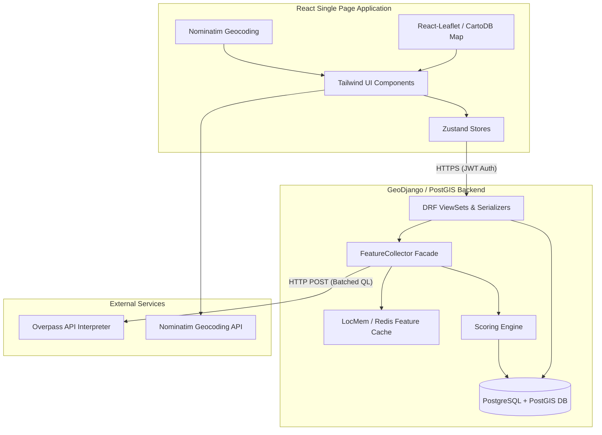
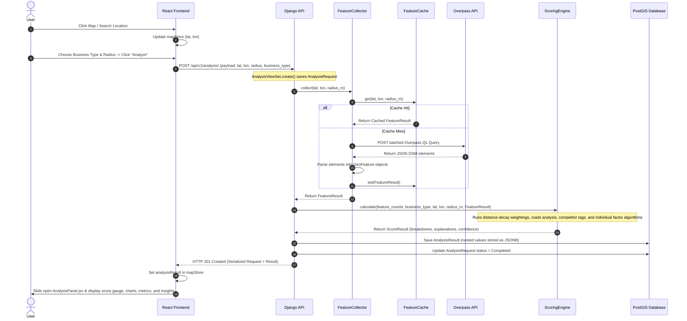

# Obrix Location Intelligence Platform: Architecture Report

This report outlines the end-to-end architecture, request flows, data models, and spatial analytics workflow of the Obrix Location Intelligence Platform. It serves as a technical reference for developers, highlighting system mechanics, folder responsibilities, and future integration points for machine learning and supplemental datasets.

---

## 1. System Architecture Overview

Obrix is structured as a decoupled web application with a modern single-page application (SPA) frontend and a spatially enabled backend service.



### Technology Stack
*   **Frontend**: React (Vite-powered SPA), TailwindCSS for utility-first styling, Lucide React for icons, and **Zustand** for state management (`authStore`, `mapStore`, `analysisStore`).
*   **Mapping**: Leaflet integrated via `react-leaflet`, styled with a professional CartoDB Dark Matter tile layer.
*   **Backend**: Python (Django + Django REST Framework), using **GeoDjango** (`django.contrib.gis`) for spatial operations.
*   **Database**: PostgreSQL with the **PostGIS** extension for spatial geometries, combined with JSONB columns for flexible schemas.
*   **Caching**: Django cache framework. In-memory (`LocMemCache`) for local development and Redis-ready for production.
*   **Asynchronous Tasks**: Pre-configured Celery architecture utilizing Redis as a broker/result backend (operational from Phase 5).

---

## 2. End-to-End Request & Data Flow

This diagram traces how a user action on the frontend traverses the system to fetch geospatial data, process it in the scoring engine, save results, and update the UI.



---

## 3. API Endpoints Reference

All API endpoints are namespaced under `/api/v1/`. Authenticated endpoints require a JWT bearer token in the `Authorization` header (`Authorization: Bearer <access_token>`).

| Method | Endpoint | Auth | Purpose |
| :--- | :--- | :--- | :--- |
| **POST** | `/api/v1/auth/register/` | Public | Registers a new user. |
| **POST** | `/api/v1/auth/login/` | Public | Generates access + refresh tokens & profile data. |
| **POST** | `/api/v1/auth/logout/` | Token | Blacklists the refresh token to end the session. |
| **POST** | `/api/v1/auth/token/refresh/` | Public | Rotates an expired access token using a refresh token. |
| **GET** | `/api/v1/auth/me/` | Token | Retrieves the current user's profile details. |
| **PATCH**| `/api/v1/auth/me/` | Token | Updates the current user's full name. |
| **GET** | `/api/v1/locations/` | Token | Lists saved location bookmarks for the current user. |
| **POST** | `/api/v1/locations/` | Token | Saves a new location bookmark (lat/lon point). |
| **PATCH**| `/api/v1/locations/{id}/` | Token | Updates a bookmark's name, description, or address. |
| **DELETE**| `/api/v1/locations/{id}/` | Token | Deletes a saved bookmark. |
| **POST** | `/api/v1/analysis/` | Token | Triggers the location analysis pipeline. |
| **GET** | `/api/v1/analysis/` | Token | Lists the user's historical analyses. |
| **GET** | `/api/v1/analysis/{id}/` | Token | Retrieves an analysis request and its nested score result. |
| **GET** | `/api/v1/analysis/{id}/result/`| Token | Retrieves the scoring results and metrics only. |
| **DELETE**| `/api/v1/analysis/{id}/` | Token | Deletes an analysis record. |
| **GET** | `/api/v1/analysis/weights/` | Token | Lists default and user-defined custom weight configurations. |
| **GET** | `/api/v1/reports/` | Token | Lists aggregated comparison reports. |
| **POST** | `/api/v1/reports/` | Token | Creates a report comparing multiple analysis requests. |

---

## 4. Database Schema & PostGIS Interactions

The database utilizes PostgreSQL 18 with PostGIS 3.6.2. Two fields leverage native spatial coordinates:

### `SavedLocation` Model
Uses a PostGIS `PointField` to represent WGS84 coordinate points.
```python
point = models.PointField(srid=4326, geography=True)
```
*   `srid=4326` standardizes coordinates to the WGS84 ellipsoid (standard latitude/longitude).
*   `geography=True` directs PostGIS to perform distance and spatial calculations on a round-earth model using meters instead of planar degrees, ensuring accurate calculations.

### `Report` Model
Utilizes a PostgreSQL-native `ArrayField` to store a list of UUIDs referring to compared `AnalysisRequest` objects:
```python
request_ids = ArrayField(base_field=models.UUIDField(), default=list, blank=True)
```
This avoids creating an intermediary many-to-many lookup table and allows efficient array-membership queries.

### `AnalysisResult` Model
Uses Django's `JSONField` mapping to PostgreSQL's native `JSONB` column type. This accommodates complex, nested data structures without rigid schema modifications:
*   `score_breakdown`: Stores calculated scores for each individual factor.
*   `osm_data_snapshot`: Retains a snapshot of the raw query metadata at the time of analysis (e.g. feature counts, source, query execution time).
*   `ai_insights` and `recommendations`: Contain prioritized suggestions based on results.
*   `raw_factors`: Retains calculated sub-scores and internal metric data for debugging or model training.

---

## 5. OpenStreetMap & Overpass Integration

The geospatial feature retrieval is abstracted behind a clean façade pattern. 

### FeatureCollector
The `FeatureCollector` is the single point of entry for the application views. It delegates calls to either the cache or the HTTP client:
1.  **Cache Check**: Coordinates are rounded to 4 decimal places (approx. 11m grid resolution) to form a cache key `obrix_geo_v1:<lat_r>:<lon_r>:<radius>`. Rounding ensures that queries made for nearby coordinates reuse the same snapshot. The cache is set to expire in 15 minutes.
2.  **API Fetch**: On a cache miss, it calls `OverpassClient.fetch()`.

### OverpassClient
The client compiles a batched Overpass QL query to download all features inside a specific radius in a single round-trip:

```query
[out:json][timeout:30];
(
  way["highway"~"^(motorway|trunk|primary|secondary|tertiary|residential|unclassified|living_street)$"](around:radius,lat,lon);
  node["amenity"~"^(hospital|clinic|doctors|nursing_home)$"](around:radius,lat,lon);
  way["amenity"~"^(hospital|clinic)$"](around:radius,lat,lon);
  node["amenity"~"^(school|college|university|kindergarten|language_school)$"](around:radius,lat,lon);
  way["amenity"~"^(school|college|university|kindergarten)$"](around:radius,lat,lon);
  node["highway"="bus_stop"](around:radius,lat,lon);
  node["public_transport"="stop_position"]["bus"="yes"](around:radius,lat,lon);
  node["leisure"="park"](around:radius,lat,lon);
  way["leisure"="park"](around:radius,lat,lon);
  relation["leisure"="park"](around:radius,lat,lon);
  way["landuse"~"^(park|recreation_ground|village_green)$"](around:radius,lat,lon);
  node["amenity"="fuel"](around:radius,lat,lon);
  way["amenity"="fuel"](around:radius,lat,lon);
  node["amenity"~"^(restaurant|fast_food|cafe|food_court|pub|bar)$"](around:radius,lat,lon);
  node["amenity"~"^(bank|atm|bureau_de_change)$"](around:radius,lat,lon);
);
out center body;
```
*   `out center body;` returns elements with tags along with the centroid latitude and longitude for ways and relations, which is crucial for calculating distances.
*   The raw response is parsed into `GeoFeature` objects and grouped into 8 categories: `roads`, `hospitals`, `schools`, `bus_stops`, `parks`, `fuel_stations`, `restaurants`, and `banks`.

---

## 6. Scoring Engine Workflow

The `ScoringEngine` processes the retrieved `FeatureResult` objects through rules and mathematical models to calculate a weighted index score between 0 and 100.

```
                  +-----------------------+
                  |  OSM Features List    |
                  +-----------+-----------+
                              |
                              v
                  +-----------+-----------+
                  |     DistanceService   | (Haversine math)
                  +-----------+-----------+
                              |
                              v
                  +-----------+-----------+
                  |  1. Distance Weighting| (Exponential Decay)
                  |  2. Density Metric    | (Features per km²)
                  |  3. Road Hierarchy    | (Road Quality Score)
                  |  4. Competition Check | (Competitor Tag Search)
                  +-----------+-----------+
                              |
                              v
                  +-----------+-----------+
                  |     Factor Modules    | (Accessibility, Infrastructure,
                  +-----------+-----------+  Commercial, Competition, Environment)
                              |
                              v
                  +-----------+-----------+
                  |   Log Normalization   | (Diminishing Returns S-Curve)
                  +-----------+-----------+
                              |
                              v
                  +-----------+-----------+
                  |     Weighted Sum      | (Business weight config profile)
                  +-----------+-----------+
                              |
                              v
                +-------------+-------------+
                | Overall Site Readiness Score| (0 - 100)
                +---------------------------+
```

### Mathematical Normalization Functions

1.  **Distance-Weighted Proximity (Exponential Decay)**:
    Rather than treating all elements in a radius equally, closer features weight higher. The weight $w_i$ for feature $i$ at distance $d_i$ within radius $R$ is:
    $$w_i = e^{-k \cdot \frac{d_i}{R}}$$
    *   Where $k$ is the `DISTANCE_DECAY_RATE` (default: `3.0`).
    *   At distance $d=0$ (center), $w_i = 1.0$.
    *   At distance $d = R/2$, $w_i \approx 0.22$.
    *   At distance $d = R$ (outer boundary), $w_i \approx 0.05$.

2.  **Logarithmic Normalization (Diminishing Returns)**:
    To prevent large numbers of features from skewing scores linearly (e.g. 50 restaurants should not score 10 times better than 5), a logarithmic saturation formula is applied:
    $$\text{sub\_score} = \text{clamp}\left( \frac{\log_{10}(1.0 + \text{observed\_count})}{\log_{10}(1.0 + \text{saturation\_threshold})} \cdot 100, 0.0, 100.0 \right)$$
    *   Once the observed count reaches the saturation threshold configured in `config.py` (e.g., 3 hospitals or 10 bus stops), the sub-score is clamped to 100.

3.  **Overall Weighted Composition**:
    The system queries the active `WEIGHT_PROFILE` matching the selected business type. The final score is:
    $$\text{Final Score} = \frac{\sum (\text{Factor Score} \times \text{Weight})}{\sum \text{Weights}}$$

4.  **Confidence Calculation**:
    The `ConfidenceCalculator` penalizes the result based on data sparsity (total features < 30), critical missing categories (no roads or no hospitals detected), or active Overpass query errors, outputting a value of "High", "Medium", or "Low" confidence.

---

## 7. Project Structure & Responsibilities

```
obrix/
├── backend/
│   ├── manage.py                       # Django CLI execution entry point
│   ├── config/                         # Django global settings & URL routing
│   ├── core/                           # Shared handlers, pagination, owner permissions
│   ├── requirements/                   # Python package dependencies
│   ├── apps/                           # Core Django Applications
│   │   ├── accounts/                   # JWT Auth, user profiles, premium subscription tier
│   │   ├── locations/                  # SavedLocation bookmarks (PostGIS PointFields)
│   │   ├── analysis/                   # Analysis request/result CRUD, pipeline execution
│   │   └── reports/                    # Aggregated comparison reports (PostgreSQL ArrayFields)
│   └── intelligence/                   # Core geospatial engine logic
│       ├── ai/                         # Insights and recommendations builder (Phase 7)
│       ├── data_sources/               # Integration point for external data feeds
│       ├── geo/                        # FeatureCollector, Overpass client, coordinate caching
│       └── scoring/                    # Normalization math, weights config, factor calculators
├── frontend/
│   ├── vite.config.js                  # Frontend build configuration
│   ├── package.json                    # Node dependencies and scripts
│   ├── tailwind.config.js              # Theme configurations and design tokens
│   ├── index.html                      # Entry HTML container
│   └── src/
│       ├── main.jsx                    # React entry file
│       ├── App.jsx                     # Top-level React App layout
│       ├── store/                      # Zustand global state (auth, map, analysis)
│       ├── services/                   # Axios API request clients (apiClient interceptors)
│       ├── router/                     # React Router configurations
│       ├── components/                 # Reusable UI widgets
│       │   ├── layout/                 # Main sidebar, layout containers
│       │   ├── map/                    # MapView, marker actions, geocoder SearchControl
│       │   ├── ui/                     # Cards, badges, spin loaders
│       │   └── analysis/               # LocationSidebar forms, results panel widgets
│       └── pages/                      # Routable view pages (Landing, Dashboard, Analyze)
```

---

## 8. Current Limitations & Extension Points

Evaluating the codebase reveals several opportunities for enhancement in subsequent phases:

### Current Limitations
1.  **Third-Party API Dependency**: The system makes synchronous HTTP calls to the public Overpass API. If Overpass is rate-limited (HTTP 429) or offline, analysis results degrade to neutral fallback scores (50.0).
2.  **Great-Circle Distances**: The current scoring calculations utilize the Haversine formula. This calculates straight-line distance ("as the crow flies") rather than routing distances across actual road networks.
3.  **Missing Analytics Factors**: The `PopulationFactor` and `LandUseFactor` are currently empty stubs that return static scores (50.0).
4.  **Static Explanations**: The `ExplainabilityBuilder` formats pre-defined text templates using calculated numbers rather than dynamic, context-aware narratives.

### Future Dataset Ingestions (Phase 4 & 6)
The system is built to scale beyond OpenStreetMap. Additional datasets can be incorporated into the existing structure:

*   **Demographic & Census Data**: Can be integrated into `PopulationFactor` to score catchment population, age brackets, and household income.
    > [!TIP]
    > **Implementation**: Load census tracts into a PostGIS table. Replace `PopulationFactor.compute()` to run a spatial query intersecting a buffer circle with census polygon geometries.
*   **Satellite & Environmental Data**: AQI (Air Quality Index), NDVI (Normalized Difference Vegetation Index for green cover), and flood vulnerability zones can enrich the `EnvironmentFactor`.
    > [!TIP]
    > **Implementation**: Query Google Earth Engine or local raster tables using PostGIS `ST_Value` to retrieve specific values at the analysis coordinates.
*   **Local OSM Data Store**: Importing regional OSM `.pbf` files directly into a local PostGIS database using `osm2pgsql` will resolve Overpass downtime.
    > [!TIP]
    > **Implementation**: Create a `PostGISDistanceService` that implements `DistanceService` to query local geometries, then update `get_distance_service()` in `distance.py` to activate it.

### Future AI & Machine Learning Integration (Phase 5 & 7)
The codebase includes structured entry points for machine learning and natural language processing:

*   **Dynamic Predictive Scoring (Phase 5)**:
    Instead of manually configuring weights per business type (e.g. `retail`, `warehouse`), you can train a supervised regression model (e.g. XGBoost, Random Forest) on historic location performance data.
    > [!IMPORTANT]
    > **Entry Point**: In `ScoringEngine.calculate()`, instead of running the weighted sum, pass the `raw_factors` dict to a trained inference model loaded via `scikit-learn` or `ONNX` to predict a custom site success probability.
*   **LLM Explanations & Generative Insights (Phase 7)**:
    Replace static text templates in `ExplainabilityBuilder` and stub logic in `ai/recommender.py` with LLM API requests.
    > [!IMPORTANT]
    > **Entry Point**: In `recommender.py`, collect the `score_breakdown` and nearby `feature_counts`. Send a prompt containing these metrics to a Gemini model (e.g., `gemini-1.5-flash`) via the Google Gen AI SDK to generate context-specific, professional location reports.
